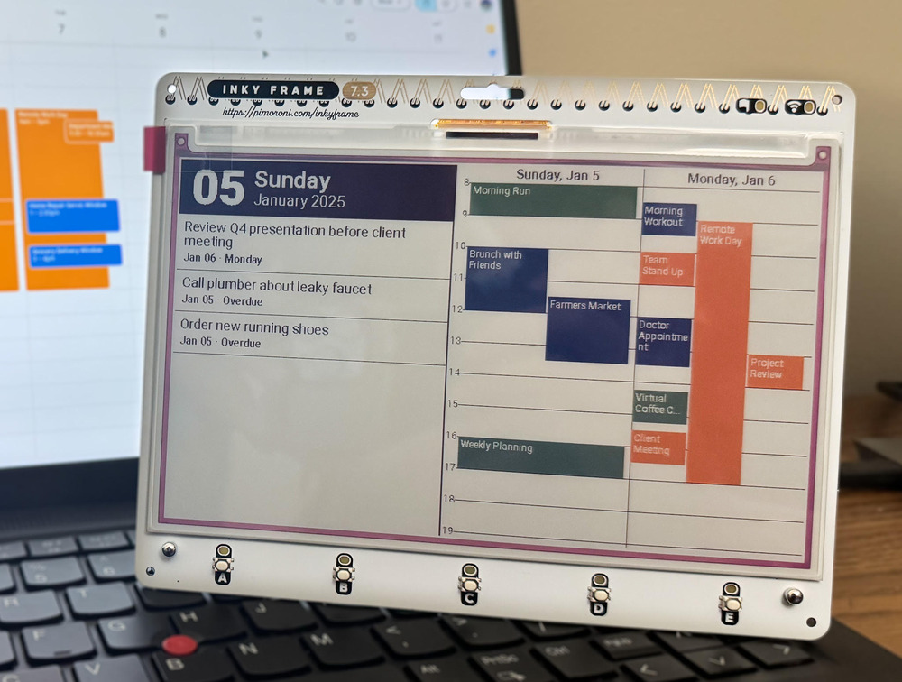

# Inky Dashboard
A simple e-ink dashboard for planning and organizing your life.

## Features
- To-do list integration with Todoist
- Calendar syncing with Google Calendar/iCal
- Multiple colors for calendar events
- Overlapping calendar events
- Deep sleep to conserve battery

## Hardware
The code is written for the [Inky Frame 7.3" 7-color E ink display](https://shop.pimoroni.com/products/inky-frame-7-3?variant=40541882056787), which is powered by a Raspberry Pi Pico W. Layout is handled using [LVGL](https://lvgl.io/), so modifying the code to work with other E ink displays shoudn't be too difficult.

## Server
The Pico isn't powerful enough to fetch the iCal data on its own, so it relies on a server program to retrieve the latest information to show on the display. That code can be found here: https://github.com/jaeheonshim/inky-dashboard-server. There are many platforms available to host the server for free - I recommend [PythonAnywhere](https://www.pythonanywhere.com)

## How to use
First, clone the [server repository](https://github.com/jaeheonshim/inky-dashboard-server) and set it up. Then, create `src/settings.hpp` from `src/settings.hpp.example`, replace `<ssid>` and `<pass>` with your own network details, and replace `<server endpoint>` with the endpoint of your server. You can also modify the update frequency in `src/inky_dashboard.cpp`.

## Files
`src/calendar.cpp` - contains calendar layout and positioning algorithm   
`src/inky_interface.cpp` - contains LVGL callback as well as other Inky Frame specific functions   
`src/net.cpp` - contains functions for retrieving the data payload from the server endpoint